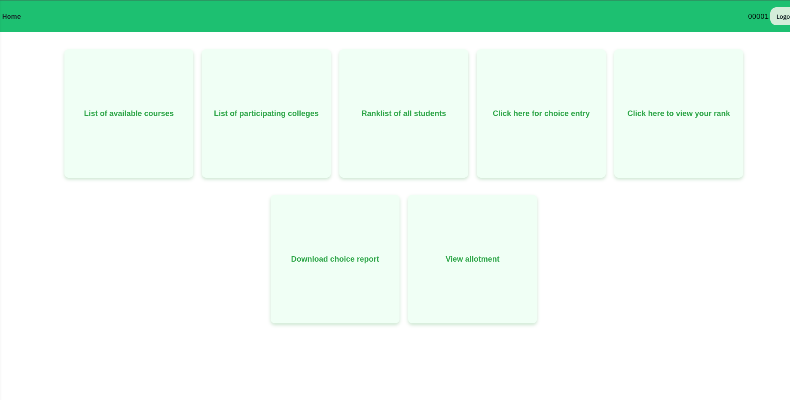
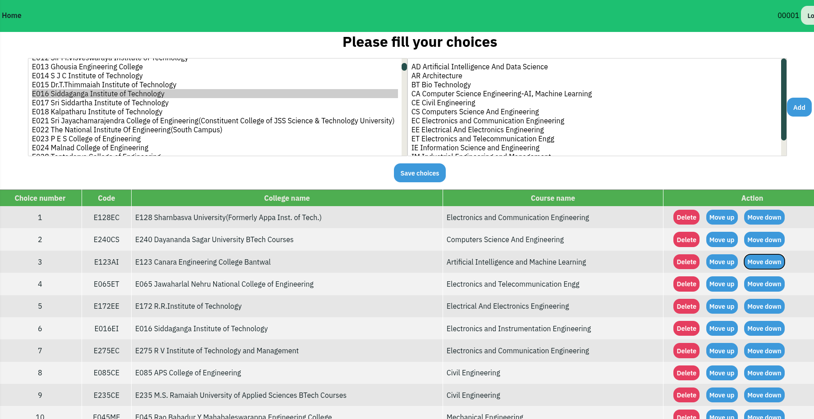
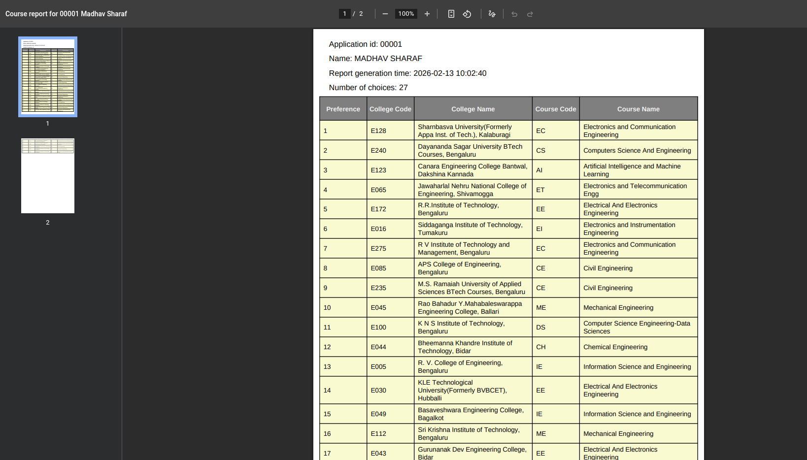

# student-college matcher
This is an implementation of the Gale-Shapely algorithm, also known as the deferred acceptance algorithm, which is used to obtain stable matching. Here, the application tries to match a number of students to courses in various colleges. This project aims to simulate the working of a system such as KCET, COMEDK, or JOSSA.
The algorithm is written in C++, which is then accessed by python through a Cython extension module. The UI is implemented in Django along with Vue for certain pages. Celery and redis is also used for caching and task management.

## Getting started

Create database `scm_site` by using `psql` or `pgadmin`.

Here is one way to do it using psql,
```
$ docker compose up db
$ docker ps
$ docker exec -it <db_container_id> ash
/ # psql -U postgres
postgres=# CREATE DATABASE scm_site;
```

Get a shell to the `web` docker container
```
$ docker compose up web
$ docker ps
$ docker exec -it <web_container_id> ash
```

To create the necessary tables: (in `web` container shell)
```
# python manage.py migrate 
```

Create the superuser with (in `web` container shell)
```
# python manage.py createsuperuser
```

### To seed the database (optional), for dummy data
Run this in the host,
```
$ mkdir db_data
$ cp dataset/data.json db_data
```
Run this in the container
```
# python manage.py seed db_data/data.json
# python manage.py generate_users
```

### To start the site
Start the site with
```
$ docker compose up
```

To run tests, (in `web` container shell)
```
# python manage.py test --no-logs --parallel auto
```

### View site

View the application at [http://localhost:8000/counselling](http://localhost:8000/counselling)

Usernames follow the following pattern: 00001, 00002, 00003 ....

and the password for every user is `password`

## Screenshots

### Home Screen (Student View)


### Choice Entry


### Choice Report


## Disclaimer

**IMPORTANT LEGAL NOTICE:**

This project is an **educational simulation** created solely to demonstrate the implementation of the Gale-Shapley (deferred acceptance) algorithm for stable matching. All data used in this project is **fictional and generated for demonstration purposes only**.

- **Student Names**: All student names are **fictitious** and have been randomly generated using the ["Faker" fake name library](https://faker.readthedocs.io/). These names do **not** refer to, identify, or represent any real individuals, living or deceased. Any resemblance to actual persons, whether fictional or real, is purely coincidental.

- **College Names**: College and institution names referenced in this project have been sourced from the **KCET (Karnataka Common Entrance Test)** counseling process and are used **strictly for educational purposes** to simulate a realistic college admission scenario.

- **No Real-World Implications**: This is **NOT** a real college admission system, nor is it affiliated with, endorsed by, or connected to KCET, COMEDK, JOSSA, or any other admission counseling body. All rankings, seats, allotments, and data shown are **completely fabricated** and do not represent any real admission process, results, or merit lists.

- **Educational Use Only**: This software is provided **"as is"** for educational and learning purposes only. The authors and contributors assume **no liability** and shall **not be held responsible** for any misinterpretation, misuse, or confusion that may arise from any resemblance of this simulated data to real-world admission processes or individuals.

By using, viewing, or referencing this project, you acknowledge that you understand and agree that all content is **fictional and intended solely for educational demonstration**.
